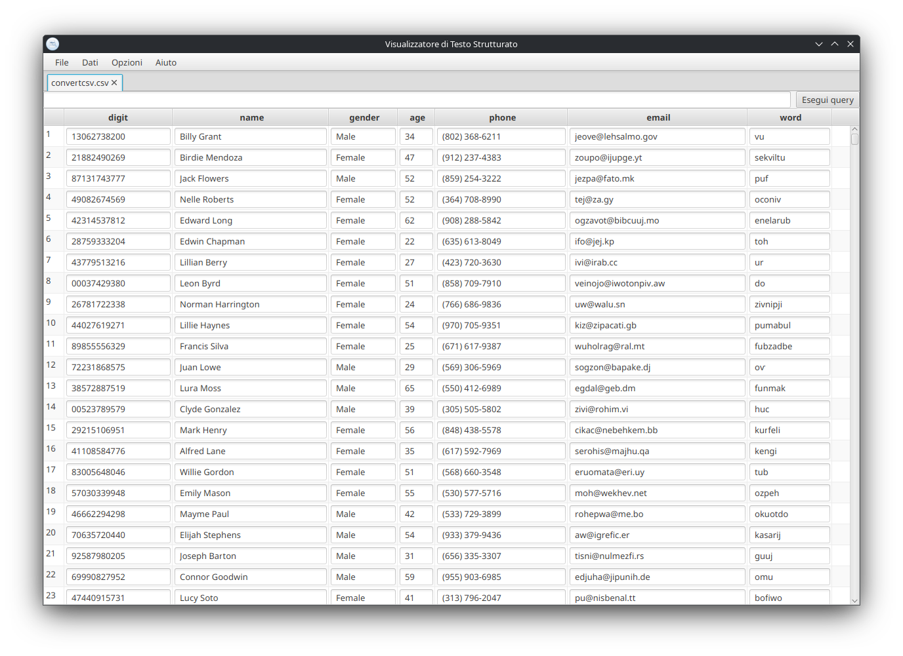
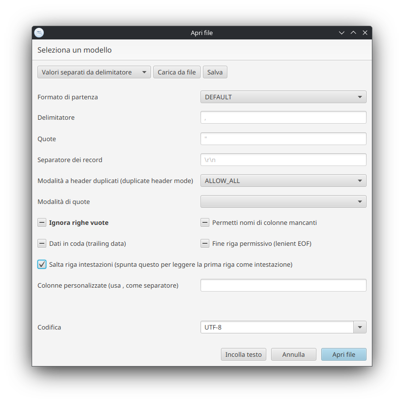
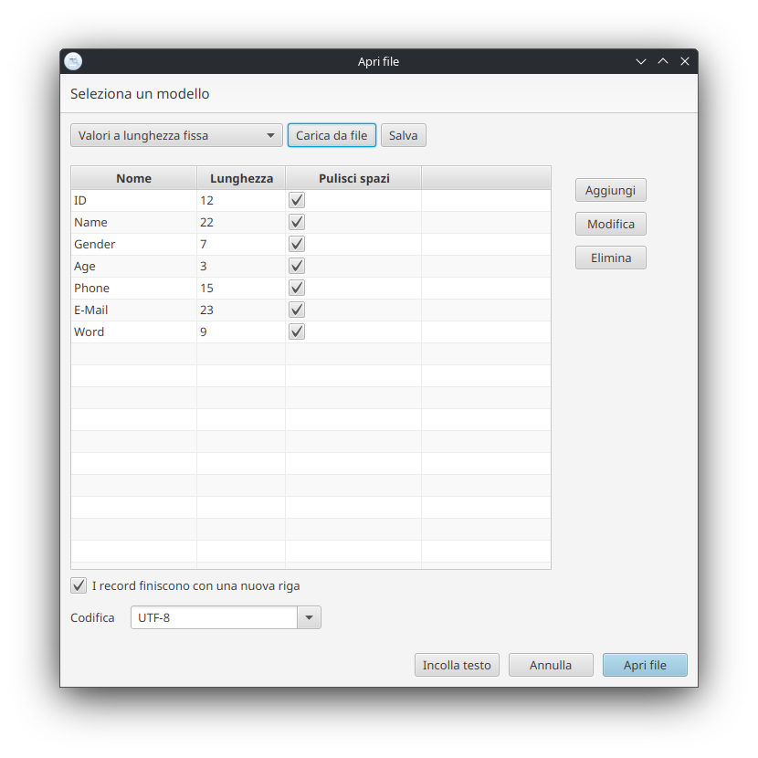

# Structured File Viewer

Structured File Viewer is a JavaFX desktop app for opening and exploring structured
text files (CSV-like and fixed-width). It focuses on fast inspection, configurable
parsing, and flexible filtering.

## Disclaimer

I wrote this application for fun in my free time.
I'm not good with UX, so it's probably not the easiest to use.
I suppose a better app exists, but I just wanted to write a desktop app 
and thought of something that I would be able to use.

Also, I used AI features, mainly for comments and the antlr4 
grammar (and for this readme).
The java code is all mine (and I say this knowing how bad it can be).
The app logo is also AI-generated (I have no art skills).

## Features

- Supported languages: English, Italian
- CSV-style parsing with delimiter/quote/charset options.
- Fixed-width parsing with editable column layouts.
- Filter/query language with AND/OR/NOT, comparisons, LIKE/ILIKE/REGEX, and
  named or positional columns.
- Load data from files or paste raw text.
- Save and load parsing settings as JSON.
- Multiple tabs and windows.

## Query language quick reference

Examples:

```text
name = 'Alice' AND age >= '30'
"Phone" LIKE '555'
$1 <> 'N/A'
NOT (status = 'inactive')
```

Notes:
- Values are single-quoted strings.
- Column names can be bare identifiers, double-quoted, or positional ($1, $2, ...).

Check the [filter language doc](filter_doc.md) for more details.

## Screenshots




## Requirements

- JDK 25 (see `pom.xml`) with JavaFX included (suggested Liberica "full" JDK).

## Run (development)

```sh
./mvnw javafx:run
```

## Build and package

Build the shaded launcher JAR:

```sh
./mvnw package
```

Create platform-specific packages (requires `jpackage`):

```sh
./build_mac.sh
./build_linux.sh
./build_windows.cmd
```

Artifacts are placed under `target/`.

## Examples

Sample files and settings live in `examples/`, including:
- `examples/test.csv`
- `examples/convertcsv.txt`
- `examples/config/flat.json` (fixed-width settings)

## License

BSD-2-Clause. See `LICENSE.txt`.
